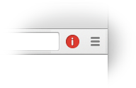
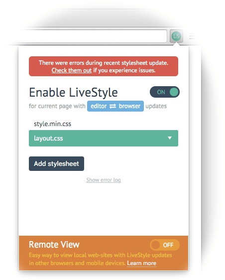
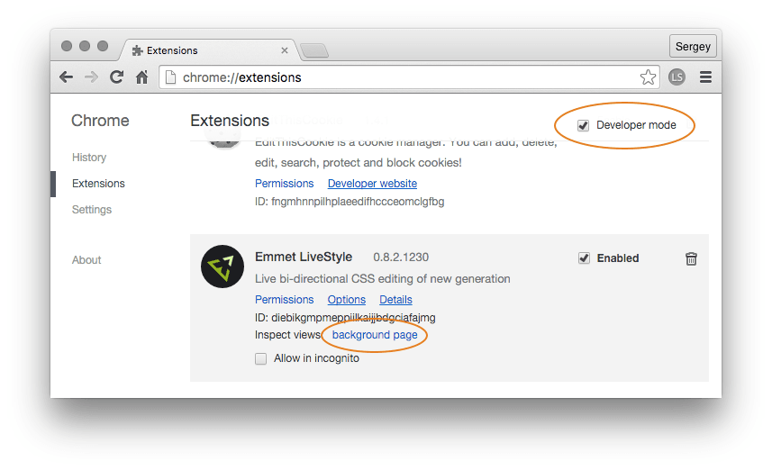

# Troubleshooting

LiveStyle is very experimental and very complex piece of software. And sometimes it doesn’t work the way as it should. This guide will help you find the cause of the problems.

## Sensitive to valid CSS

For the best bi-directional live edit experience, LiveStyle performs [source patching](/docs/using-livestyle/#source-patching): it parses stylesheet into object model and makes decisions about updated data. *It means your CSS/LESS/SCSS must be syntactically valid.* LiveStyle tries to recover from simple mistakes but sometimes it fails to do so.

If a stylesheet can’t be parsed at all or ther were critical error during live update, you’ll see a LiveStyle icon in Google Chrome flashing red for some time:

If you click on this icon, you’ll see an error notification in extension popup. Also, a persistent “Show error log” link will appear in popup so you can click on it and review what caused errors:

## Empty list of stylesheets

If you open LiveStyle popup and see no stylesheets but you sure that current page contains external stylesheets, try the following:

* Close DevTools and check out popup again. Open DevTools and check again.
* Refresh current page.
* Close the tab and open again.

Most likely this error may appear after extension automatic update. 

## No connection

Chrome extension connects to editor via Websocket protocol. If you see “No connection” error, it might be one of the following:

* Sublime Text is not running or LiveStyle extension for Sublime Text is not installed.
* Your current network settings/proxy/firewall blocks connection to `http://127.0.0.1:54000`—a Websocket server runs on this address. Contact your system administrator about this issue.

Another reason of “No connection” issue is broken Sublime Text web-server implementation. Check out `View > Show Console` in ST for error log. In this case you can open [LiveStyle app](/#download) and then restart ST: LiveStyle app has its own server implementation so when Sublime Text starts, it will use it instead of creating a new one.

## Getting debug data

If your stylesheet if perfectly valid, you see no error notifications, but LiveStyle still doesn’t work as expected, you can check out an internal debug log for more info.

To get debug log:

1. In Goggle Chrome, go to Extensions preference page at `chrome://extensions/`.
2. Enable “Developer mode” in the upper right corner.
3. Click on “background page” in *Emmet LiveStyle* extension:

It will open a DevTools window. Go to “Console” pane to see debug log and possible hints about what’s going wrong.

## Reporting errors and suggestions

If you find errors in LiveStyle or you have some ideas about what can be improved, you can [report an issue](https://github.com/livestyle/issues/issues). Please follow these simple rules before creating issue:

* Look over opened issues, someone might already filled same the issue and there are discussions about possible workarounds.
* Describe as much as possible what you did, what you expect and what caused errors. Reports like “LiveStyle is not working!!!!” are not helpful at all.
* Please add debug log (either as text log or screenshot) with possible error reports.
* If possible, attach a stylesheet fragment that caused errors.
* Attaching screenshots and small videos/animated gifs that demonstrate errors will help *alot*.