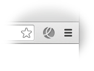
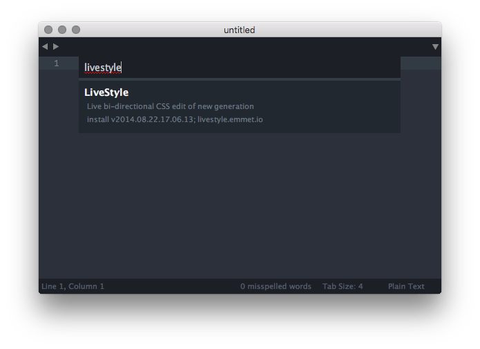

# Getting started

LiveStyle is a tool for live CSS editing, similar to popular [LiveReload](http://livereload.com), [CodeKit](https://incident57.com/codekit/) etc. The idea is simple: you edit CSS file in your editor, save it and see how web-page in your browser that contains this stylesheet is automatically refreshed, giving you a visual feedback of changes you just made.

Almost all such live edit tools works in pretty much the same way: they are watching for file updates in given folder, do some additional processing (for example, convert LESS to CSS) and finally update a web-page. Which means you have to *save* your source file and *wait* for a few seconds just to see how a single change affects page.

LiveStyle introduces a *truly live* editing experience: it updates web-page immediately, as-you-type in text editor. Without file saving or page reloading. And this is the first tool able to bring updates from browser DevTools back into source code *the right way*.

## Installation

For best live editing experience, LiveStyle integrates directly into browser and code editor. So the very first thing you have to do is to install browser and editor plugins (currently, only [Google Chrome](https://www.google.com/chrome/) and [Sublime Text](http://www.sublimetext.com/) are supported).

The easiest way to do so is to use [LiveStyle app](/#download):

1. [Download LiveStyle app](/#download) for your OS (no Linux support yet, please use [manual installation](#manual)).
2. Unpack and run it.
	* *OSX users*: For the first time you have to right-click on `LiveStyle.app` and pick “Open” menu item to bypass system warning.
	* *Windows users*: When running LiveStyle for the first time, Windows may ask for network access permissions. Please allow network access, it is required to download plugins and for [Remote View](/docs/remote-view/).

If everything is fine, you’ll see app window like this:

LiveStyle app shows available plugins and their installation status, as well as [Remote View](/docs/remote-view/) sessions list. Click on “Install” buttons to run installation process.

When both browser and editor plugins are installed, you can close LiveStyle app: you’ll need it only for [Remote View](/docs/remote-view/) feature.

## Manual installation

If you experience issues with downloading and running LiveStyle app, you can try manual installation.

### Google Chrome plugin

1. In Chrome, go to [LiveStyle WebStore page](https://chrome.google.com/webstore/detail/emmet-livestyle/diebikgmpmeppiilkaijjbdgciafajmg).
2. Click on **Add to Chrome** button in the upper right corner:

When installed, you’ll see an **LS** icon in Chrome toolbar:

---

### Sublime Text plugin

The easiest way to install Sublime Text plugin is via [Package Control](https://packagecontrol.io). This is a preferred way to install Sublime Text plugins: Package Control will manage all installation process and automatic updates for you.

1. Install Package Control [as described](https://packagecontrol.io/installation) (if you didn’t installed it yet).
2. In Sublime Text, pick `Tools > Command Palette...` menu item.
3. In opened dialog, type `install package` to find `Package Control: Install Package` menu item. Select it with arrow keys and hit Enter.

4. Wait for a few seconds while Package Control loads list of available packages.
5. When loaded, you’ll see a dialog window with list of available packages. Type `livestyle` to find LiveStyle package and hit Enter.

In a moment LiveStyle plugin will be installed. You may want to restart Sublime Text to ensure that everything works fine.

#### Manual installation of Sublime Text plugin

If you can’t or don’t want to use Package Control, you can try a completely manual installation:

1. In Sublime Text, pick `Preferences > Browse Packages...` menu item. It will open `Packages` folder in your file browser.
2. Create `LiveStyle` folder in opened `Packages` one.
3. [Download](https://github.com/livestyle/sublime-text/archive/master.zip) and unpack plugin code archive into newly created `LiveStyle` folder.
4. In the end, your file structure should look like this:

5. Restart Sublime Text.