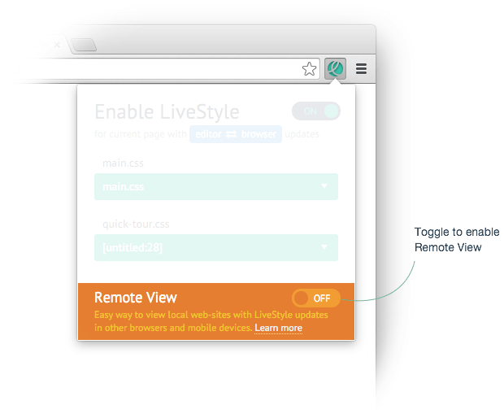

# Remote View

During a project development, you’ll likely have local web-site running on a simple web-server with `http://localhost:8080` address or something. Everything works fine until you wish to test your local web-site on external device, say, mobile phone. It’s not a problem if your computer and phone are on the same network, all you need is to use network IP of your computer (like `http://10.0.1.2:8080`) to preview your local web-site on mobile.

But what if you want to use a service like [BrowserStack](https://www.browserstack.com) for testing on different devices? Or you want to share your work with colleagues or clients? In this case you have to put a copy of your project to publicly-available server. This might be not so quick and easy, especially if your web-site requires server-side logic.

With LiveStyle you have much easier and better better solution. Try *Remote View*.

Remote View issues a publicly-available domain that points to your local web-server. Share this URL with you co-workers, clients, use it with services like BrowserStack to test your project on real devices and so on. Moreover, Remote View automatically enables LiveStyle updates for such URLs! Use DevTools and code editor to tweak styles and see instant updates on multiple devices at once.

## Tutorial: using Remote View

For this tutorial we’ll use a [demo page](/demo/) and [sample stylesheet](/demo/layout.css) from “[Using LiveStyle](/docs/using-livestyle/)” tutorial.

**You need a running [LiveStyle app](/#download) to use Remote View feature.**

1. In Google Chrome, visit a web-site you want to share. For this tutorial, we’ll use http://livestyle.io/demo/, but you can use your local web-site like `http://localhost:8080`.
2. Click on **LS** icon to open LiveStyle popup and toggle Remote View:

> When enabled for a first time, you will be asked for authorization permission. You need a Google account to authenticate.
3. In a few seconds, you’ll see a public domain like `some-name.livestyle.io`that points to domain of the page where you enabled Remote View. If you enabled it for demo page, it will point to `http://livestyle.io`, if enabled for `http://localhost:8080/about/`, it will point to `http://localhost:8080` and so on. Use this domain to preview you local web-site on external devices or other browsers. But for now simply click on this public domain to open the same page via Remote View in another tab.
4. Now, in Sublime Text edit a CSS file associated with browser file of original page (e.g. `layout.css`) and you should see that both original and Remote View pages are updated immediately.
5. In tab with original page, open DevTools and update some style—the Remote View page will be updated too!
6. When you’re done, simply turn off Remote View in LiveStyle popup to terminate session: `some-name.livestyle.io` will no longer point to your local web-site. The session will be automatically terminated if no one used Remote View domain for a 30 minutes.

As you can see, it’s very easy to tweak your web-page on real devices with no effort. You can even create a live collaboration session with your clients or co-workers: share a Remote View URL and impress them instant style updates!

> Remote View is a paid service available for free during beta test.
