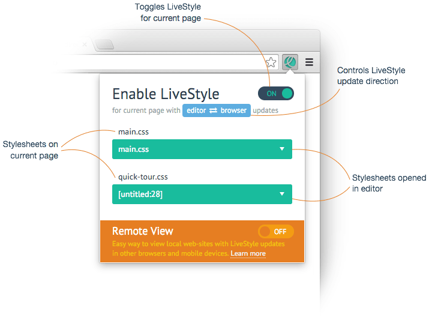
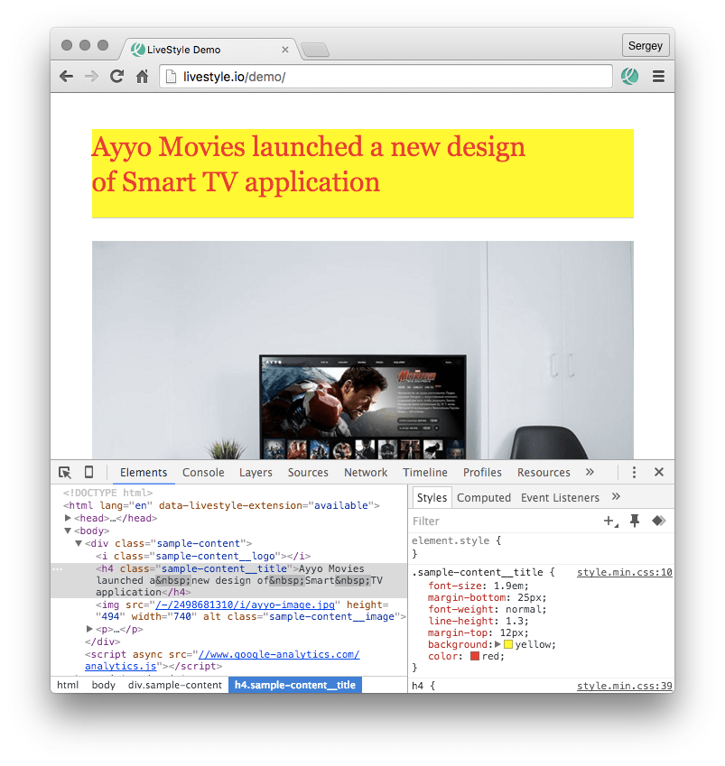

# Using LiveStyle

After [installing browser and editor plugins](../), you are ready to start using LiveStyle.

All LiveStyle settings are controlled via Google Chrome extension:



The LiveStyle popup displays list of stylesheets, available on current web-page. Below each browser stylesheet is a drop-down list with all stylesheets, opened in editor. To start using LiveStyle, you simply enable it for current page and associate browser stylesheet with one of the editor stylesheet. After that, all updates from editor stylesheet will be pushed to designated browser stylesheet and vice versa.

Sometimes you may want to disable bi-directional stylesheet updates and keep, for example, editor-to-browser updates only so your DevTools experiments won’t break your source code. To do so, click on a blue button to cycle through update modes:

* `editor ⇄ browser` enables full bi-directional updates;
* `editor → browser` enables editor-to-browser updates only, all updates made in DevTools will be ignored;
* `editor ← browser` enables DevTools-to-editor updates only, all updates made in editor will be ignored.

## Tutorial: making first live updates

Let’s create our first live updates session to see how easy and fun LiveStyle to use!

1. Download the [example stylesheet](/demo/layout.css) and open it in Sublime Text.
2. In Google Chrome, go to a [demo page](/demo/). That’s right, we are going to use *a remote web-site you don’t have direct access to* for live updates! But we’ll talk about this a bit later.
3. Click on **LS** icon in toolbar to open popup and enable LiveStyle for current page.
4. The popup displays `style.min.css` as the only browser stylesheet. In most cases, LiveStyle will try to automatically associate browser and editor stylesheets using their file names. But since our stylesheets has different names—`style.min.css` and `layout.css`—we have to associate them manually. Simply pick `layout.css` from a drop-down list.
5. You are ready to go! In Sublime Text, change the `color` property to `red` in `h1 {...}` rule and you should see how `Hello world` on page turns red! Play around with `h1 {...}` and add, for example, `background: yellow;`.
6. Now open DevTools and find and click on `<h1 class="page-title">` element. You should see that *Styles* contains your recent updates made in code editor:

7. In DevTools, set `color` of `h1` header to `blue`—and the source code in Sublime Text updates accordingly. Go ahead, add `padding: 10px;` for `h1` in DevTools.

You just saw how easy it is to start live CSS editing with LiveStyle, but you haven’t discovered the most powerful feature yet.

## Source patching

Take a look at the [source code of `style.min.css`](/demo/style.min.css). It’s... not exactly the same as `layout.css`: it’s minified and contains more CSS rules and properties.

In modern web-development, the stylesheet in browser is not the same as the source code developers write. They split large CSS codebase into modules, then concatenate them into a singe file, minify it, run additional post-processors (like [Autoprefixer](https://github.com/postcss/autoprefixer)) and so on to deliver the best result to end-users. And LiveStyle aware of that.

Instead of *replacing* code (like other live edit tools do), LiveStyle uses *source patching*: it detects CSS properties you’ve changed, affected CSS rules and maps those changes to another source. You can think of it as [React](https://facebook.github.io/react/) for CSS: instead of replacing view contents with plain `innerHTML`, it applies a series of advanced techniques to detect and update only changed parts and keep previous state as much as possible.

To better illustrate how it works, let’s get back to our example from tutorial above. In [demo page](/demo/), there are two CSS rules applied to page header: `h1` and `.page-title`. The `.page-title` rule is present in `style.min.css` but absent in `layout.css`. 

In DevTools, change `margin-bottom` property of `.page-title {...}` to  `1em` and you should see that a new rule appeared in text editor:

```
.page-title {
    margin-bottom: 1em;
}
```

Now add `font-style: italic;` property into `.page-title {...}` rule in text editor and note that page header becomes italic but still draws bottom border, despite the fact that `border-bottom` property is absent text editor part. In other words, LiveStyle sends only updated properties and applies them on the other end. It doesn’t replace neither CSS rule nor stylesheet completely.

---

That’s why you have to associate browser and editor stylesheets in LiveStyle, which may look a bit awkward at first. You can, for example, associate a small CSS module you’re working on with concatenated and minified full stylesheet source of your web-page. Get instant live updates with focus on your current task instead of wasting your time waiting tens of seconds until full CSS source is recompiled and updated in browser, like with other live edit tools.

## Things you should learn

* LiveStyle updates CSS instantly, without file saving or page reloading. And this is the first tool that do this in both directions: from editor to browser and from browser to editor.
* You don’t need any special build tool or web-server to use LiveStyle: almost every web-site in the internet can be you playground. Try to add some style to [facebook.com](http://facebook.com) :)
* You can use *any* CSS file for live editing, no matter how you got it: opened from hard drive, directly from FTP server or just created it without saving. If you can work with this file in text editor, then you can use it for live editing. *PS: don’t forget to set `CSS` syntax for newly created and unsaved files.*
* LiveStyle uses source patching: you can easily tweak your small CSS modules right on your *production* web-site with large concatenated and minified code base.